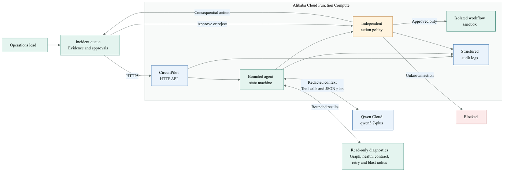

# CircuitPilot

CircuitPilot is a Qwen-powered workflow incident response agent. It turns an ambiguous automation failure into a redacted evidence set, invokes bounded diagnostic tools, proposes a reversible remediation plan, and stops every consequential action at a human approval checkpoint.



Build article: [Building a Qwen agent that cannot approve its own changes](https://tinyopsstudio.com/building-qwen-agent-human-approval)

Need the same evidence-and-approval review for an existing automation? [Buy the fixed-scope $149 TinyOps workflow audit](https://whop.com/joined/tinyops-studio-llc/products/ai-workflow-automation-audit/).

## What it demonstrates

- Qwen Cloud tool calling over the OpenAI-compatible Chat Completions API.
- A multi-step diagnostic loop grounded in tool results rather than model claims.
- Independent policy enforcement that model output cannot bypass.
- Secret and email redaction before prompts, logs, or API responses are created.
- Human approval for state-changing or credential-related actions.
- Sandbox-only execution with an auditable before-and-after workflow state.
- Alibaba Cloud Function Compute deployment through the included `s.yaml`.
- Structured audit events captured by Function Compute logs.

## Architecture

The browser talks only to the CircuitPilot API on Alibaba Cloud Function Compute. The agent sends a redacted incident context to Qwen Cloud, exposes four read-only diagnostic functions, validates the final JSON plan, then passes each action through a deterministic policy catalog. Read-only notes may run automatically. Workflow changes, replays, pauses, and credential handoffs require an explicit operator decision and execute only against the isolated demo workflow.

The editable diagram source is in [`docs/architecture.mmd`](docs/architecture.mmd).

## Run locally

Requirements: Node.js 20 or later.

```bash
npm start
```

Open `http://localhost:3000`. Without a Qwen Cloud key, the application runs in clearly labeled local safety mode using deterministic fixtures.

To run the live Qwen path:

```bash
export DASHSCOPE_API_KEY="your-qwen-cloud-key"
export QWEN_MODEL="qwen3.7-plus"
npm start
```

The key is read only from the environment and is never returned to the browser, written to logs, or committed.

## Test and benchmark

```bash
npm test
npm run benchmark
npm run check
```

The deterministic benchmark covers four failure classes: connector authentication, payload contract drift, retry amplification, and missing idempotency. It asserts the diagnosis, expected remediation type, approval coverage, and redaction boundary for each case.

With live Qwen Cloud credentials, run the same four cases through Qwen and fail closed if any run degrades, skips additional tool use, misses the expected diagnosis or action, bypasses approval, or leaks a fixture email:

```bash
export DASHSCOPE_API_KEY="your-qwen-cloud-key"
npm run live-eval
```

The evaluation prints only a judge-safe aggregate report. It never prints the API key or raw private values.

## API

| Method | Route | Purpose |
| --- | --- | --- |
| `GET` | `/health` | Runtime, deployment, provider, and model status |
| `GET` | `/api/scenarios` | Redacted demo incident queue |
| `POST` | `/api/runs` | Start a diagnostic run |
| `GET` | `/api/runs/:id` | Read a run and its audit timeline |
| `POST` | `/api/runs/:id/actions/:actionId/decision` | Approve or reject one bounded action |

## Alibaba Cloud deployment

The repository includes a Serverless Devs 3 configuration for Function Compute in Singapore.

```bash
export circuitpilot_serverless_devs_key='{"AccountID":"...","AccessKeyID":"...","AccessKeySecret":"..."}'
export DASHSCOPE_API_KEY="your-qwen-cloud-key"
export QWEN_BASE_URL="https://your-workspace-id.ap-southeast-1.maas.aliyuncs.com/compatible-mode/v1"
npx @serverless-devs/s@3.1.10 verify -t s.yaml
npx @serverless-devs/s@3.1.10 deploy -t s.yaml --assume-yes
```

`circuitpilot_serverless_devs_key` follows Serverless Devs' environment-backed credential format. Use a least-privilege RAM user. The manifest resolves the Qwen key and endpoint from the deployment process and passes them to Function Compute; do not place real credentials in `s.yaml`. If `QWEN_BASE_URL` is omitted, the Singapore shared DashScope endpoint is used. The API key and endpoint must belong to the same region.

The public HTTP trigger serves the application and API from the same function, while Function Compute captures structured audit logs emitted on every run and operator decision.

## Safety model

CircuitPilot treats all incident text, payloads, logs, and tool output as untrusted data. The model can select only four read-only diagnostic tools. Tool arguments are validated against the current fixture, and there is no shell, arbitrary HTTP, credential, filesystem-write, or production connector tool.

The model proposes actions by name. The policy engine owns risk, approval, and execution behavior. Unknown action names are blocked. Credential rotation produces a manual handoff and never handles credential material. See [`docs/security.md`](docs/security.md) for the threat model.

## Hackathon build disclosure

CircuitPilot was created during the Global AI Hackathon Series with Qwen Cloud submission period. TinyOps Studio LLC had an earlier, small deterministic email-intake routing demo and an established brand mark. The Qwen integration, agent loop, diagnostic tools, policy engine, incident fixtures, approval workflow, sandbox executor, operator UI, benchmark, documentation, and Alibaba Cloud deployment package in this repository are new work. Details are recorded in [`docs/build-log.md`](docs/build-log.md).

## License

MIT. Copyright 2026 TinyOps Studio LLC.
